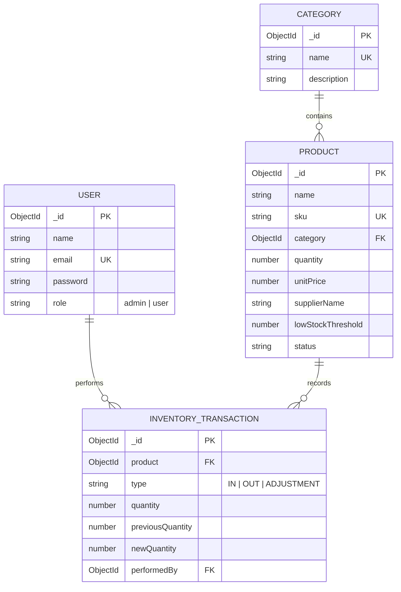

# 📦 RED SOFTWARE - CRUD Inventory Management System

A responsive, enterprise-ready **CRUD Inventory Management System** built with **Node.js, Express, MongoDB (Mongoose), and Angular (Standalone Components + Tailwind CSS)**.

Designed and developed for the **RED Software Full Stack Developer Assignment**.

---

## 🌟 Key Features

### 🔐 1. Authentication & Security
- **JWT-Based Authentication**: Secure stateless token issuance and verification.
- **Role-Based Access Control (RBAC)**: Distinct permissions for `admin` and `user` (Staff) roles.
- **Password Encryption**: Industry-standard `bcryptjs` hashing with 10 salt rounds.
- **Route Guards & Interceptors**: Angular `authGuard`, `adminGuard`, and HTTP interceptors automatically attaching tokens and handling session expiration.

### 📊 2. Interactive Analytics Dashboard
- **KPI Metrics**: Real-time cards for Total Products, Total Categories, Total Stock Quantity, Low Stock Items, Out of Stock Items, and Gross Inventory Valuation.
- **Visual Status Breakdown**: Interactive progress visualization displaying proportion of In Stock, Low Stock, and Out of Stock products.
- **Category Stock Distribution**: Visual bar chart tracking physical units across categories.
- **Critical Restock Alert Table**: Immediate action table highlighting items at or below threshold with a **One-Click Quick Restock modal**.
- **Recent Movement Stream**: Live feed displaying latest warehouse dispatches, intake, and audit adjustments.

### 📦 3. Complete Product CRUD
- **Add, View, Edit, Delete**: Modal-based and dedicated detail views.
- **Required Fields**: Name, SKU (Unique, Uppercase), Category, Quantity, Unit Price, Supplier Name, Low Stock Limit, Description, Image.
- **Automatic Stock Status**:
  - $\text{Quantity} = 0 \rightarrow$ **Out of Stock**
  - $0 < \text{Quantity} \le \text{Threshold} \rightarrow$ **Low Stock**
  - $\text{Quantity} > \text{Threshold} \rightarrow$ **In Stock**
- **Search, Filter & Sort**:
  - Live search across Name, SKU, and Supplier.
  - Category dropdown filter.
  - Stock status filter chips (*All*, *In Stock*, *Low Stock*, *Out of Stock*).
  - Multi-attribute sorting (*Name*, *Quantity*, *Price*, *Date*).
  - Server-side and client-side pagination with configurable page size.

### 🗂️ 4. Category Management
- Categorize products with names and descriptions.
- Dynamic count of assigned items per category.
- Safeguard deletion: Prevents deleting categories that contain active products.

### 🔄 5. Stock Management & Audit Ledger
- **Stock In (Intake)**: Log restock shipments with purchase order numbers or reasons.
- **Stock Out (Dispatch)**: Log sales and fulfillments.
- **Negative Stock Prevention**: Strictly prevents stock from falling below 0 with validation on frontend, controller, and schema levels.
- **Audit Adjustment**: Reconcile physical warehouse counts (Admin only).
- **Transaction Audit Ledger**: Complete chronological audit trail showing timestamp, product, user, delta, previous balance, new balance, and notes.

### 🎁 6. Bonus Features Implemented
- ⚡ **Redis In-Memory Caching & Auto-Invalidation**: Caches heavy read routes (Dashboard analytics, paginated product catalog, categories, and inventory audit trail) with non-blocking pattern invalidation on data changes and zero-downtime graceful fallback to MongoDB if Redis is offline.
- 🏷️ **QR Code Generation**: Automatically generates printable QR code tags with product SKU and specs. Includes direct download and print options.
- 📥 **Export to CSV**: Download entire catalog to standard CSV format.
- 📤 **Import from CSV**: Upload batch CSV files with automatic categorization and transaction creation.
- 🌓 **Dark Mode**: Seamless toggle between clean light and dark theme with persistent storage.
- 🐳 **Docker & Docker Compose**: Full-stack containerization for MongoDB, Redis, Express API, and Angular frontend (via Nginx).
- 📮 **Postman Collection**: Ready-to-import JSON collection in `docs/inventory_management_postman_collection.json`.
- 🧪 **Automated Backend Test Suite**: Automated integration tests validating auth, CRUD, search, QR codes, negative inventory prevention, and caching behavior.

---

## 🛠️ Technology Stack

| Layer | Technologies |
| :--- | :--- |
| **Frontend** | Angular 21 (Standalone Components, Signals, Reactive Forms), Tailwind CSS 4, Lucide SVG Icons |
| **Backend** | Node.js, Express.js, Mongoose ODM, JWT, BcryptJS, Multer, QRCode, Json2csv |
| **Cache Layer** | Redis 7+ (`redis` client), Cache Middleware, Pattern Invalidation (`SCAN`) |
| **Database** | MongoDB 6.0+ |
| **DevOps** | Docker, Docker Compose, Nginx Alpine |
| **Testing** | Jest, Supertest |
| **Documentation**| Postman Collection, Mermaid ER Diagrams |

---

## 🏗️ Architecture & Project Structure

```
Inventory_Management_System/
├── backend/                       # Node.js + Express REST API
│   ├── src/
│   │   ├── config/                # Database (Mongoose) & Redis configuration
│   │   ├── controllers/           # Auth, Products, Categories, Inventory, Dashboard
│   │   ├── middleware/            # JWT Auth, RBAC, Cache Middleware, Error Handler, Upload
│   │   ├── models/                # User, Category, Product, InventoryTransaction
│   │   ├── routes/                # Express API Route definitions
│   │   ├── utils/                 # Database Seeder & Cache Invalidator
│   │   ├── app.js                 # Express Application bootstrap
│   │   └── server.js              # Server entry point
│   ├── tests/                     # Automated API Integration Tests (Jest)
│   ├── uploads/                   # Uploaded product images
│   ├── .env.example               # Sample environment configuration
│   ├── package.json
│   └── Dockerfile
├── frontend/                      # Angular 21 Standalone SPA
│   ├── src/
│   │   ├── app/
│   │   │   ├── core/              # Models, Services, Interceptors, Guards
│   │   │   ├── layout/            # Navbar, Sidebar, Shell Layout
│   │   │   ├── pages/             # Dashboard, Products, Categories, Stock, Auth
│   │   │   ├── shared/            # Toasts, Modals, Pagination, QR Modal, Icons
│   │   │   ├── app.config.ts      # Application config & providers
│   │   │   └── app.routes.ts      # Application routing
│   │   └── styles.css             # Tailwind CSS styles
│   ├── Dockerfile                 # Production build & Nginx serve
│   └── nginx.conf                 # Nginx reverse proxy configuration
├── docs/
│   ├── database-schema.md         # Database ERD & schema specifications
│   └── inventory_management_postman_collection.json # Postman collection
├── docker-compose.yml             # Multi-container orchestration
└── README.md
```

---

## 🚀 Quick Start Guide

### Prerequisites
- [Node.js](https://nodejs.org/) (v18 or higher; v20/v24 recommended)
- [MongoDB](https://www.mongodb.com/) running locally on port 27017 (or MongoDB Atlas URI)

---

### Step 1: Clone the Repository
```bash
git clone <repository-url>
cd Inventory_Management_System
```

---

### Step 2: Setup and Start Backend
```bash
# 1. Navigate to backend directory
cd backend

# 2. Install dependencies
npm install

# 3. Configure environment variables (a pre-configured .env is provided)
cp .env.example .env

# 4. Seed database with rich sample data (Admin & User accounts, categories, products)
npm run seed

# 5. Start development API server
npm run dev
# Or production start:
# npm start
```
> The API will be running at: **http://localhost:5000**

---

### Step 3: Setup and Start Frontend
Open a new terminal window:
```bash
# 1. Navigate to frontend directory
cd frontend

# 2. Install dependencies (if not already installed)
npm install

# 3. Start Angular development server
npm start
```
> The application will be accessible at: **http://localhost:4200**

---

### 🐳 Optional: Run with Docker Compose
If you prefer running everything in isolated Docker containers:
```bash
docker-compose up --build
```
This starts:
- MongoDB at `localhost:27017`
- Redis Cache at `localhost:6379`
- Backend API at `localhost:5000`
- Frontend Web App at `localhost:80`

---

## 🔑 Default Demo Accounts

For instant testing, pre-seeded accounts are provided with one-click demo login buttons on the login screen:

| Role | Email | Password | Permissions |
| :--- | :--- | :--- | :--- |
| **Administrator** | `admin@example.com` | `Admin@123` | Full access: CRUD Products, Categories, Stock Adjustments, CSV Import/Export, Audit Logs |
| **Staff Member** | `user@example.com` | `User@123` | Operational access: View Catalog, Stock In, Stock Out, View Analytics |

---

## 🧪 Testing

### Backend Automated Integration Tests
The backend contains a test suite covering authentication, authorization, CRUD operations, QR generation, negative stock prevention, and analytics.

```bash
cd backend
npm test
```

### Frontend Production Build Verification
```bash
cd frontend
npm run build
```

---

## 📄 Database Entity Relationship Diagram (ERD)

See the full schema documentation in [`docs/database-schema.md`](docs/database-schema.md).



---

## 📐 Assumptions & Architectural Trade-offs

1. **Angular Standalone Architecture**:
   - Modern standalone components with Signals and `@for` / `@if` control flow are utilized instead of legacy NgModules, maximizing performance and reducing bundle sizes.
2. **Stock Status Derivation**:
   - Stock status (`In Stock`, `Low Stock`, `Out of Stock`) is computed dynamically via Mongoose hooks before saving to ensure that external queries or exports remain consistent without requiring client-side computation.
3. **Negative Stock Prevention**:
   - Enforced across 3 tiers: UI disables dispatch button if requested amount exceeds on-hand stock; Express controller validates current balance before decrementing; Mongoose schema enforces `min: 0`.
4. **Data Integrity for Categories**:
   - Categories containing assigned products cannot be deleted unless products are first reassigned or deleted, safeguarding against orphaned records.

---

## 📬 Submission Contact

- **Reviewer**: sanket.debnath@redsoftware.in
- **CC**: hr.redsoftware.in
- **Project Repository**: Prepared for GitHub submission.
