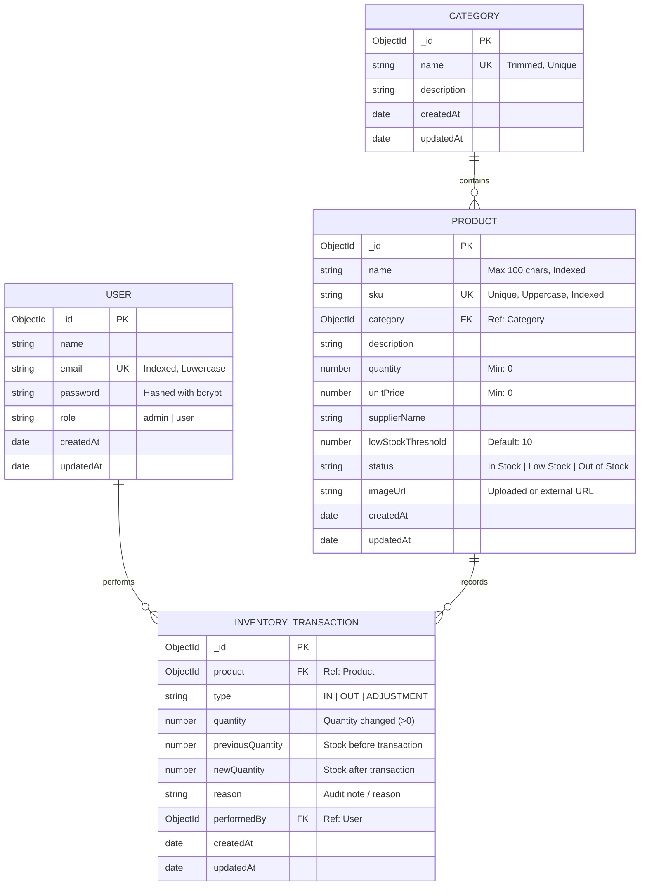

# Database Schema & Entity-Relationship Design

This document details the normalized database architecture designed for the **CRUD Inventory Management System** using MongoDB and Mongoose ODM.

---

## 1. Entity-Relationship Diagram (ERD)

---

## 2. Collection Schemas & Data Types

### 2.1 `users` Collection
Stores administrative and operational staff credentials with role-based access.

| Field | Type | Modifiers / Constraints | Description |
| :--- | :--- | :--- | :--- |
| `_id` | `ObjectId` | Auto-generated PK | Unique user identifier |
| `name` | `String` | Required, trim, max: 50 | Full display name of the user |
| `email` | `String` | Required, unique, trim, lowercase | Normalized email address for login |
| `password` | `String` | Required, min: 6, hashed | Salted and hashed password using `bcryptjs` (salt rounds: 10) |
| `role` | `String` | Enum: `['admin', 'user']`, default: `'user'` | Role controlling action authorizations |
| `createdAt` | `Date` | Timestamp | Account creation timestamp |
| `updatedAt` | `Date` | Timestamp | Account profile update timestamp |

**Indexes**:
- `{ email: 1 }` (Unique)

---

### 2.2 `categories` Collection
Stores product categorizations for inventory grouping, filtering, and reporting.

| Field | Type | Modifiers / Constraints | Description |
| :--- | :--- | :--- | :--- |
| `_id` | `ObjectId` | Auto-generated PK | Unique category identifier |
| `name` | `String` | Required, unique, trim, max: 50 | Category name (e.g., Electronics, Furniture) |
| `description`| `String` | Max: 250, default: `''` | Summary of items in category |
| `createdAt` | `Date` | Timestamp | Category creation timestamp |
| `updatedAt` | `Date` | Timestamp | Last update timestamp |

**Virtuals**:
- `productsCount`: Dynamic count of active products mapped to this category via Mongoose virtual populate.

**Indexes**:
- `{ name: 1 }` (Unique)

---

### 2.3 `products` Collection
Primary entity representing physical inventory stock items.

| Field | Type | Modifiers / Constraints | Description |
| :--- | :--- | :--- | :--- |
| `_id` | `ObjectId` | Auto-generated PK | Unique product identifier |
| `name` | `String` | Required, trim, max: 100 | Commercial item name |
| `sku` | `String` | Required, unique, uppercase, max: 30 | Stock Keeping Unit code (e.g., `ELEC-MON-001`) |
| `category` | `ObjectId` | Required, Ref: `Category` | Foreign reference to associated category |
| `description`| `String` | Trim, optional | Technical specifications and details |
| `quantity` | `Number` | Required, min: 0 | Current stock on hand |
| `unitPrice` | `Number` | Required, min: 0 | Purchase/selling price per unit |
| `supplierName`| `String`| Required, trim, max: 100 | Primary supplier/vendor |
| `lowStockThreshold` | `Number` | Min: 1, default: 10 | Stock quantity threshold triggering low-stock alert |
| `status` | `String` | Auto-computed: `'In Stock' \| 'Low Stock' \| 'Out of Stock'` | Real-time stock status based on quantity |
| `imageUrl` | `String` | Default: `''` | Uploaded static asset path or public image URL |
| `createdAt` | `Date` | Timestamp | Record creation timestamp |
| `updatedAt` | `Date` | Timestamp | Last modification timestamp |

**Status Computation Business Rule**:
$$\text{Status} = \begin{cases} \text{"Out of Stock"} & \text{if } \text{quantity} = 0 \\ \text{"Low Stock"} & \text{if } 0 < \text{quantity} \le \text{lowStockThreshold} \\ \text{"In Stock"} & \text{if } \text{quantity} > \text{lowStockThreshold} \end{cases}$$

**Indexes**:
- `{ sku: 1 }` (Unique)
- `{ name: "text", sku: "text", supplierName: "text" }` (Compound Text Index)
- `{ category: 1 }` (Foreign reference index)
- `{ status: 1 }` (Fast status filtering index)

---

### 2.4 `inventorytransactions` Collection
Immutable audit log recording every inventory movement (stock replenishment, customer dispatches, physical inventory audit adjustments).

| Field | Type | Modifiers / Constraints | Description |
| :--- | :--- | :--- | :--- |
| `_id` | `ObjectId` | Auto-generated PK | Unique transaction identifier |
| `product` | `ObjectId` | Required, Ref: `Product` | Targeted product |
| `type` | `String` | Enum: `['IN', 'OUT', 'ADJUSTMENT']` | Type of inventory operation |
| `quantity` | `Number` | Required, min: 1 | Absolute delta volume changed |
| `previousQuantity`| `Number` | Required, min: 0 | Balance before movement |
| `newQuantity` | `Number` | Required, min: 0 | Balance after movement |
| `reason` | `String` | Default: `'Manual stock update'` | Reason description or reference memo |
| `performedBy` | `ObjectId` | Required, Ref: `User` | User who authorized or executed change |
| `createdAt` | `Date` | Timestamp | Exact date and time movement occurred |

**Validation Constraint**:
- Prevents negative inventory: $\text{newQuantity} \ge 0$ is strictly verified at schema, controller, and database levels.

**Indexes**:
- `{ product: 1, createdAt: -1 }` (Fast transaction history query per product)
- `{ performedBy: 1 }` (Audit by user)
- `{ type: 1 }` (Filter by transaction type)
